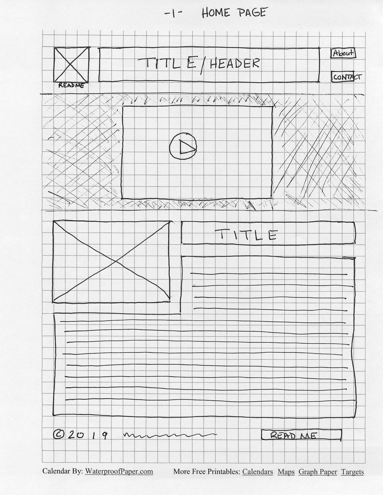
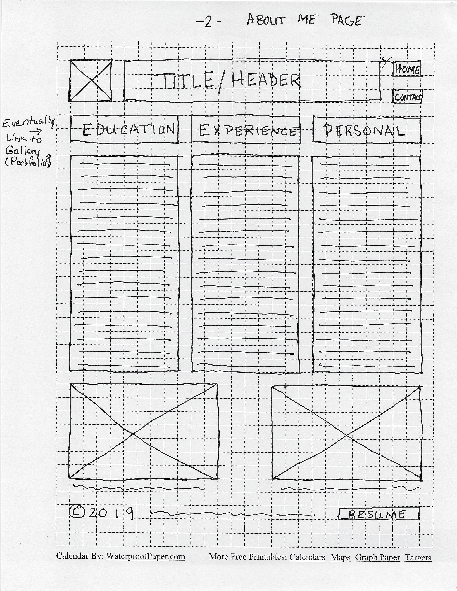
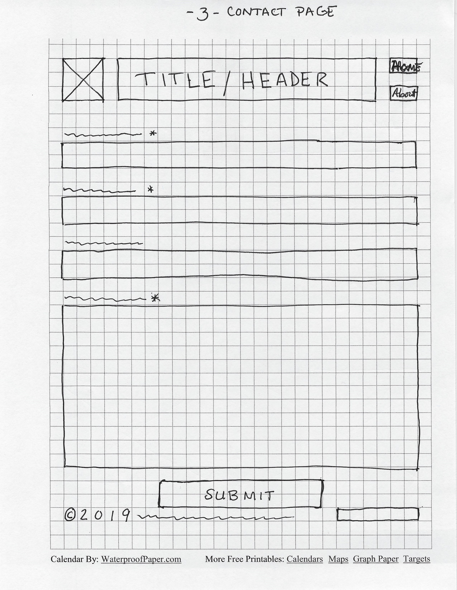

# Stephanie Lawson's Portfolio

I am going to build a portfolio website. The purpose of this website is to provide a venue to showcase my work and help secure a job just before graduation.

## Wireframes

Planning is a valuable part of website development. Here are some wireframes that show potential architecture and layout for the site. 

Header - will include a thumbnail image, my name, and the navigation menu

Navigation Menu - will include links to other pages 

Main Content - will include an introduction video, an image, and a paragraph highlighting the path that lead me to public libraries and some of my skills

Footer - will included copyright information and the READ ME file

Header - will include a thumbnail image, page title, and the navigation menu

Navigation Menu - will include links to other pages

Main Content - will include three columns containing education, job experience, and personal interests and volunteer experience information as well as two images with captions

Footer - will include copyright information and a resume button linking to a file containing a printable resume

Header - will include thumbnail images, page title, and the navigation menu

Navigation Menu - will include links to other pages

Main Content - will include labeled text fields for name, phone number, email, and message, and a submit button

Footer - will include copyright information and phone number as alternative contact method